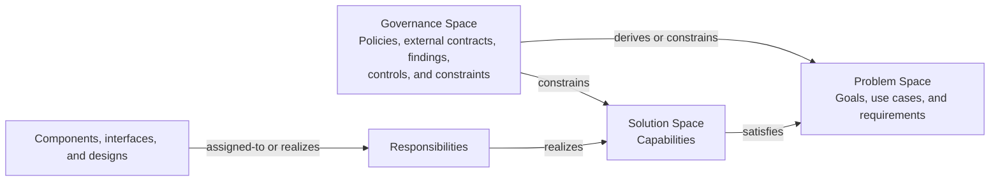
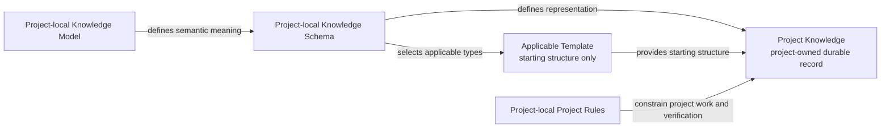

# Knowledge Architecture and Artifact Responsibilities

Document ID: SOL-003

> Evidence source: [`defaults/knowledge-model.md`](../../defaults/knowledge-model.md), [`defaults/knowledge-schema.md`](../../defaults/knowledge-schema.md), [`defaults/rules/`](../../defaults/rules/), and [`defaults/agent-guide.md`](../../defaults/agent-guide.md), inspected 2026-08-30. These sources evidence the current shared-runtime architecture; the project-local authority model below is intentional target design pending implementation.

## Capabilities

### CAP-001 — Durable knowledge separation

Provide a shared structure that separates intended outcomes, reusable constraints, and technical realization while retaining the relationships among them.

### CAP-002 — Deliberate guidance authority

Provide distinct semantic, representation, and operating-policy authorities so a project can customize its knowledge vocabulary and guidance deliberately.

### CAP-003 — Deliberate model migration mapping

Provide a Markdown-readable, project-owned crosswalk for reviewing semantic correspondences and non-correspondences while replacing a Knowledge Model.

## Responsibilities

### RESP-001 — Knowledge-space classification

Realizes: CAP-001

Classify durable records by their primary meaning and preserve the relationships that connect Problem, Governance, and Solution knowledge.

### RESP-002 — Semantic authority stewardship

Realizes: CAP-002

Resolve the active Knowledge Model as the authority for concepts and relationship meaning.

### RESP-003 — Representation and policy resolution

Realizes: CAP-002

Resolve the complete project-local active Harness and apply the Model, Schema, Rules, Templates, Skills, and guide within their distinct authority domains.

### RESP-004 — Model migration crosswalk stewardship

Realizes: CAP-003

Define and review mappings between source and target Model concepts and relationships, and between Schema-owned represented fields with their source and target Schemas identified. Record mapping kind, cardinality, identity and reference treatment, migration disposition, and unresolved ambiguity. Keep one Model active and require deliberate project-owned migration decisions.

## Components and Boundaries

### IFC-001 — Knowledge-space relationship model

The three spaces form a connected graph, not a required document hierarchy or one-to-one delivery chain.

- **Problem Space** owns stakeholder intent and externally meaningful obligations: actors, goals, use cases, requirements, and acceptance criteria. It answers why work matters and what must be true without prescribing unmandated implementation.
- **Governance Space** owns reusable or external obligations and their applicability: policies, external contracts, findings, controls, and constraints. It can derive requirements or constrain Solution knowledge directly when appropriate.
- **Solution Space** owns the intentional technical structure that realizes applicable obligations: capabilities, responsibilities, components, interfaces, designs, decisions, and Verification Items. Project Rules own the project-wide verification approach; execution results are evidence rather than automatically durable Solution knowledge.
- A finding is evidence, not automatically a control; a control, constraint, or requirement requires justified scope and applicability. A solution capability is not a business goal, and a decision does not redefine a requirement.

### IFC-002 — Guidance-authority relationship model

- The **Knowledge Model** defines the meaning of durable concepts and relationships. The project-local Model is active after initialization; the installed package Model is an initialization and update candidate only. It does not dictate document layout or workflow mechanics.
- The **Knowledge Schema** defines how project knowledge is represented: document types, heading names and order, identifiers, references, and template selection. The project-local Schema is active and does not describe or redefine the active Model's concepts.
- **Project Rules** define how project work should or must be performed, such as coding, documentation, verification, architecture, and delivery practices. The project's local Rules form the active collection. Rules do not redefine Model semantics or Schema representation.
- **Templates** provide starting structure and template-local completion instructions that refer to active-Model concepts. The active Schema—not template availability—determines whether a template type applies; a field name has no shared meaning outside its selected template.
- Existing project knowledge remains the project-owned durable record. When creating or updating it, apply the Model for meaning, the active Schema for representation and template selection, the selected Template's local completion instructions, and applicable Rules for constraints.
- During Project Knowledge reconciliation, a Git baseline identifies the accepted record and the resulting Project-Knowledge diff is candidate state. Candidate state is not authoritative merely because it appears in the working repository; it becomes accepted only after clean independent reconciliation and any required owner review.
- No artifact overrides another outside its authority domain: Rules cannot redefine Schema representation, Skills cannot redefine Workflow completion, and Workflows cannot redefine the active Model's semantics.

## Satisfies

- CAP-002 — Deliberate guidance authority satisfies:
  - PROB-002#REQ-016 — Project-local active Harness authority
  - PROB-002#REQ-017 — Materialized Harness initialization
- CAP-003 — Deliberate model migration mapping satisfies:
  - PROB-002#REQ-015 — Deliberate Knowledge Model migration mapping

## Design and Decisions

### DEC-001 — Three connected knowledge spaces

Scaffold represents durable knowledge primarily in Problem, Governance, and Solution spaces. Classification follows semantic meaning rather than folder structure, and the spaces remain many-to-many connected through explicit relationships.

### DEC-002 — Separate semantic, representation, and policy authority

The active project-local Knowledge Model is the semantic contract and the sole source of concept and relationship meaning. The active project-local Knowledge Schema encodes and decodes that contract without making a field name a second semantic definition. Each selected local Template provides completion instructions that refer to Model concepts. Local Project Rules guide project work. Keeping these authorities distinct avoids shared/local resolution and implicit merging; material cross-authority disagreement is reconciled in the artifact outside its authority rather than decided by a global precedence chain.

### DEC-003 — Conceptually structured, physically coherent knowledge

Knowledge objects may have independent semantic identities without requiring one physical file per object. The default representation favors sufficiently contextual Markdown documents; a project may adopt a more granular representation only through its active Knowledge Schema. A Problem document represents one coherent subject, not every item that happens to share a project, actor, dependency, implementation area, or repository layout. Connections among separate subjects remain explicit relationships rather than implicit document containment.

Project Context is a lightweight, Schema-owned orientation representation for project-wide purpose, goals, terms, scope, exclusions, and material unknowns. It is distinct from a Problem document and does not add a semantic space or redefine Goals, which remain Problem-space concepts under the Knowledge Model.

### DEC-005 — Explicit model-migration crosswalks

A Knowledge Model replacement may require a project-owned Crosswalk that maps concepts or relationships as equivalent, renamed, split, merged, superseded, retired, or unmapped. A Schema replacement may map represented fields only with the source and target Schemas identified. Each mapping records cardinality and identity treatment so many-to-many correspondences remain expressible. The Crosswalk informs a deliberate migration; it neither combines Model authority nor enables automatic semantic rewriting.

## Verification Items

### VER-001 — Project-local active-artifact authority

Verifies:

- PROB-002#AC-022 — Active artifacts resolve project-locally.

Scope:

- authority boundaries among the active Knowledge Model and replaceable artifacts.

Expected evidence:

- runtime resolution uses only the materialized project-local Model, Schema, Rules, Templates, Skills, and agent guide, without package fallback or merging.

## Related Knowledge

- PROB-002#REQ-016 — Project-local active Harness authority.
- PROB-002#REQ-017 — Materialized Harness initialization.
- PROB-002#REQ-015 — Deliberate Knowledge Model migration mapping.
- SOL-002#CAP-004 — Package candidate and starter artifact provision.
- SOL-002#DEC-001 — Schema-selected template applicability.
- SOL-002#DEC-004 — Pending Project Context representation.
- GOV-002#CON-003 — Durable source-of-truth boundaries.
